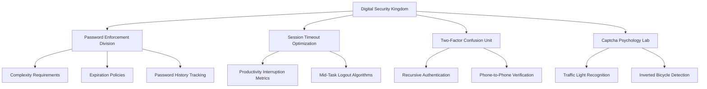

import LegalNoticeDisclaimer from "@site/src/components/LegalNoticeDisclaimer";
import DietrichTipGenerator from "@site/src/components/DietrichTipGenerator";
import PasswordComplexityCalculator from "@site/src/components/PasswordComplexityCalculator";
import SecurityMetricsDashboard from "@site/src/components/SecurityMetricsDashboard";

Behind every impossible password policy and inexplicable session timeout lurks one man: Dietrich von Passwordschmidt, Keeper of the Digital Keys. Discover the twisted genius who believes user frustration is the highest form of cybersecurity, and why he considers your productivity a security vulnerability.

<!-- truncate -->

# Meet Dietrich: Keeper of the Digital Keys

_Senior Director of Digital Fortress Operations & Chief Guardian of Cyberspatial Integrity_

---

## The Legend Himself

Dietrich von Passwordschmidt didn't choose the security life—the security life chose him. Born during a particularly aggressive Windows Update, Dietrich emerged from the digital womb with an innate understanding that users are the weakest link in any security chain, and it's his sacred duty to remind them of this fact approximately 47 times per day.

With over 15 years of experience in "Creative Authentication Solutions" and a PhD in Applied User Frustration from the University of Digital Obstruction, Dietrich has pioneered revolutionary approaches to keeping data safe by making it functionally inaccessible to the people who need it.

## Dietrich's Security Philosophy

> "A system is only as secure as its most inconvenient authentication method. If users can access their data without crying, we've failed them."
>
> — _Dietrich von Passwordschmidt, in his TED talk "Zero Trust, Zero Mercy"_

## Professional Achievements

## Security Metrics Dashboard

Dietrich's innovative KPI tracking system monitors the true indicators of cybersecurity success:

<SecurityMetricsDashboard />

## The Mathematics of Security

Dietrich's groundbreaking research has produced several key formulas that govern modern digital security:

**Base Security Score:**

$$
Security_{Level} = \frac{Password_{Length} \times Complexity_{Factor}}{User_{Happiness}^2}
$$

**Optimal Session Timeout:**

$$
Timeout_{Minutes} = \frac{Task_{Importance} \times Focus_{Level}}{Frustration_{Tolerance}} - 3
$$

**Two-Factor Authentication Effectiveness:**

$$
2FA_{Success} = \frac{Steps_{Required} \times Devices_{Needed}}{Logic \times Convenience}
$$

**Test Your New Password:**

<PasswordComplexityCalculator />

## Daily Wisdom from Dietrich

<DietrichTipGenerator />

## Employee Testimonials

> "Before Dietrich's new authentication system, I could log in to our CRM in under 30 seconds. Now it takes 15 minutes and requires three different devices. I've never felt more secure... or more dead inside."
>
> — _Janet from Sales_

> "Dietrich's password policy forced me to use `Tr0ub4dor&3!@#$%^&\*()\_+{}:"<>?[]\\;\',./'` as my password. I can't remember it, but neither can hackers. Genius."
>
> — _Mike from Accounting_

> "I now spend 40% of my day just logging into things. It's like a full-time job within my full-time job. Dietrich calls this 'employment optimization.'"
>
> — _Sarah from HR_

## Awards & Recognition

- **2024**: "Most Creative Use of Digital Barriers" - International Association of Productivity Destroyers
- **2023**: "Lifetime Achievement in User Adversity" - Society of Systematic Obstruction
- **2023**: "Innovation in Authentication Recursion" - Federation of Infinite Loops
- **2022**: "Excellence in Session Management Sadism" - Academy of Authorized Annoyance

## Office Motivational Posters

Dietrich's cube features an inspiring collection of security-focused artwork:

- "SECURITY THROUGH OBEDIENCE" _(featuring a majestic eagle clutching a USB key)_
- "Your Password Expired While You Were Reading This" _(minimalist design)_
- "Trust No One, Especially Yourself" _(team building themed)_
- "A Day Without Authentication Is A Day Wasted" _(inspirational sunset)_

## Fun Facts About Dietrich

- Changes his own password every 3 hours "to stay sharp"
- Has never successfully completed his own authentication process on the first try
- Refers to password managers as "digital crutches for the weak-minded"
- Believes CAPTCHA should be harder and include advanced calculus
- Dreams in hexadecimal
- His middle name is actually "Zweifaktor" (Two-Factor in German)

---

_Want to experience Dietrich's security innovations firsthand? Check out his latest masterpiece: [Official SSO Implementation Guide →](/sso-implementation-guide)_

---

<LegalNoticeDisclaimer />
